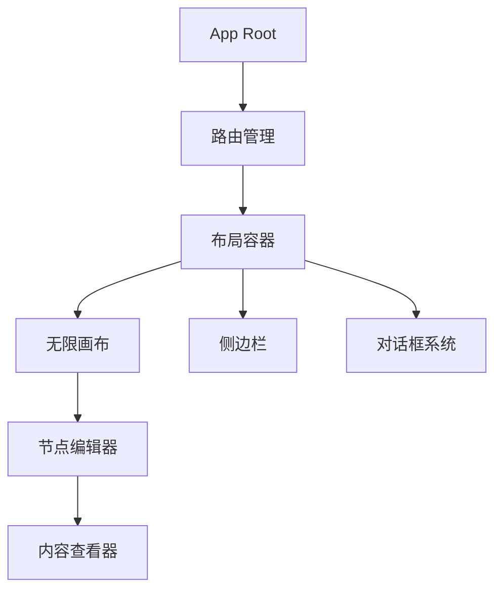
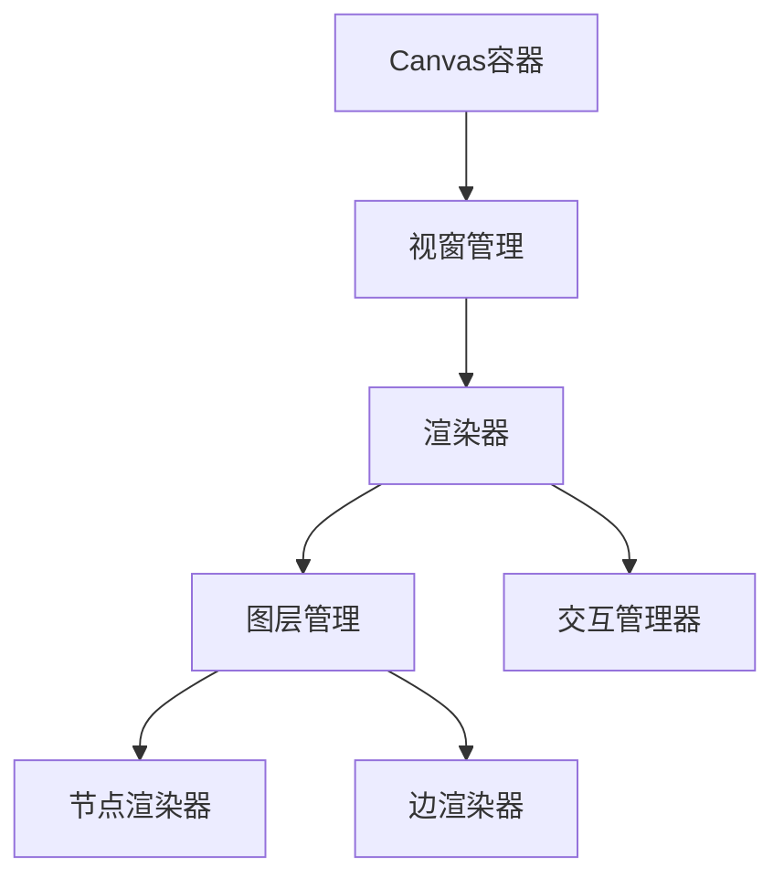
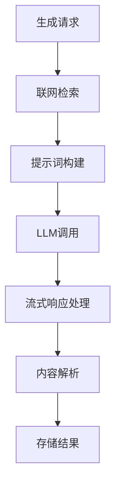
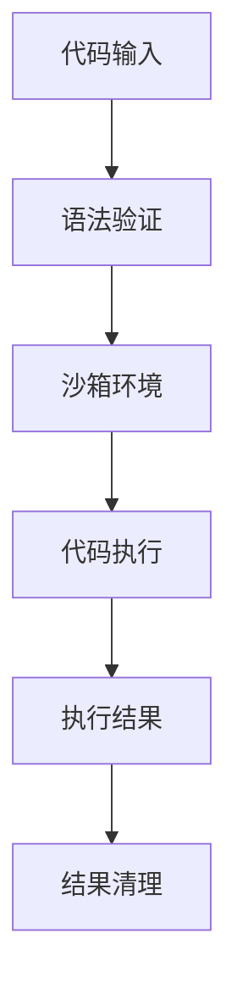
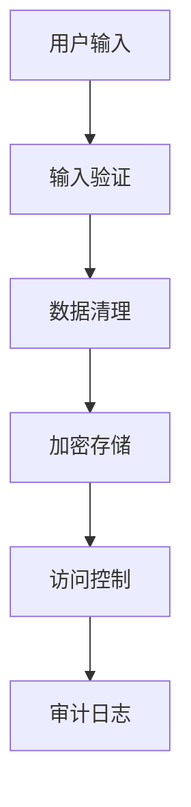

# AI 自学辅助工具 - 架构设计文档

## 一、项目概述

这是一个基于无限画布的AI辅助学习工具，核心功能包括：
- 无边际节点树编辑器
- AI驱动的知识生成和联想推荐
- 可运行代码片段支持
- 思维导图生成与编辑
- 深度LLM集成和联网检索

## 二、系统架构设计

### 2.1 整体架构

```mermaid
graph TB
    subgraph "客户端 (Browser)"
        UI[React + TypeScript UI]
        Canvas[Canvas/WebGL 渲染引擎]
        Cache[IndexedDB 本地缓存]
        WS[WebSocket 连接]
    end

    subgraph "API Gateway"
        Auth[认证服务]
        Router[路由分发]
        RateLimit[限流控制]
    end

    subgraph "后端服务"
        LLM[LLM 服务]
        Search[检索服务]
        CodeExec[代码执行沙箱]
        Storage[数据存储服务]
        FileStore[文件存储服务]
    end

    subgraph "外部服务"
        OpenAI[OpenAI API]
        Bing[Bing Search]
        Google[Google Custom Search]
    end

    UI --> API Gateway
    Canvas --> Cache
    WS --> API Gateway
    API Gateway --> LLM
    API Gateway --> Search
    API Gateway --> CodeExec
    API Gateway --> Storage
    API Gateway --> FileStore
    LLM --> OpenAI
    Search --> Bing
    Search --> Google
```

### 2.2 技术栈选择

#### 前端技术栈
- **框架**: React 18 + TypeScript
- **状态管理**: Zustand (轻量级状态管理)
- **UI组件**: Radix UI + Tailwind CSS
- **Canvas渲染**: PixiJS (WebGL加速) 或 Konva.js
- **Markdown渲染**: Remark + Rehype 生态
- **图表可视化**: D3.js + Mermaid.js
- **思维导图**: 自研基于Canvas的编辑器
- **存储**: LocalForage (IndexedDB封装)
- **实时通信**: Socket.IO客户端

#### 后端技术栈
- **语言**: Node.js (TypeScript) + Python (代码执行)
- **框架**: Express.js + GraphQL (可选)
- **数据库**: PostgreSQL + Redis (缓存)
- **缓存**: Redis
- **文件存储**: MinIO (S3兼容)
- **消息队列**: Redis Queue 或 Bull
- **容器化**: Docker + Kubernetes
- **API文档**: OpenAPI 3.0

#### 关键组件选择

1. **Canvas渲染引擎**
   - 首选: PixiJS - 高性能WebGL渲染，支持大量节点
   - 备选: Konva.js - 功能丰富，易于使用
   - 自研方案: 基于Canvas2D的分层渲染 + RAF

2. **LLM集成**
   - OpenAI GPT-4/3.5-turbo (主要)
   - Azure OpenAI (企业用户)
   - 支持流式响应 (Streaming API)

3. **检索服务**
   - Bing Web Search API (推荐)
   - Google Custom Search API
   - Elasticsearch (自建索引)

4. **代码执行沙箱**
   - Docker容器化执行
   - WebAssembly (WASM)
   - AWS Lambda或类似FaaS服务

5. **数据存储**
   - PostgreSQL: 结构化数据 (用户、节点、边)
   - Redis: 缓存和会话
   - MinIO: 文件存储 (动画、思维导图等)

### 2.3 前端架构设计

#### 组件架构



#### 状态管理设计

```typescript
// 全局状态结构
interface AppState {
  user: User | null;
  project: Project;
  nodes: Node[];
  edges: Edge[];
  ui: {
    theme: 'light' | 'dark';
    sidebarOpen: boolean;
    selectedNodeId: string | null;
    canvas: {
      zoom: number;
      pan: { x: number; y: number };
    };
  };
  preferences: UserPreferences;
}

// 使用Zustand进行状态管理
const useAppStore = create<AppState & AppActions>()((set, get) => ({
  // ... 状态定义和action实现
}));
```

#### Canvas渲染架构



### 2.4 后端API架构

#### REST API设计

```
POST   /api/v1/projects           # 创建项目
GET    /api/v1/projects/:id       # 获取项目
PUT    /api/v1/projects/:id       # 更新项目
DELETE /api/v1/projects/:id       # 删除项目

POST   /api/v1/nodes              # 创建节点
GET    /api/v1/nodes/:id          # 获取节点
PUT    /api/v1/nodes/:id          # 更新节点
DELETE /api/v1/nodes/:id          # 删除节点

POST   /api/v1/nodes/:id/generate # 生成节点内容
GET    /api/v1/nodes/:id/ideas    # 获取联想推荐

POST   /api/v1/code/execute       # 执行代码
POST   /api/v1/search             # 联网检索

WebSocket /api/v1/ws              # 实时通信
```

#### GraphQL Schema (可选)

```graphql
type Query {
  project(id: ID!): Project
  node(id: ID!): Node
  nodes(projectId: ID!, filter: NodeFilter): [Node!]!
}

type Mutation {
  createNode(input: CreateNodeInput!): Node!
  updateNode(id: ID!, input: UpdateNodeInput!): Node!
  generateNodeContent(id: ID!, theme: String!): Node!
  executeCode(input: ExecuteCodeInput!): ExecutionResult!
}

type Subscription {
  nodeUpdated(projectId: ID!): Node!
  projectChanged(userId: ID!): Project!
}
```

### 2.5 数据模型设计

#### 核心数据结构

```typescript
// 节点数据结构
interface Node {
  id: string;
  projectId: string;
  parentId?: string;
  theme: string;
  summary: string;
  contentMd: string;
  toc: TableOfContentsItem[];
  annotations: Annotation[];
  favorites: boolean;
  animations: Animation[];
  mindmap?: MindMapData;
  position: { x: number; y: number };
  metadata: {
    createdAt: Date;
    updatedAt: Date;
    version: number;
    status: 'generating' | 'completed' | 'error';
  };
}

// 边数据结构
interface Edge {
  id: string;
  projectId: string;
  fromNodeId: string;
  toNodeId: string;
  fromAnchor: 'top' | 'bottom';
  toAnchor: 'top' | 'bottom';
  meta: {
    type?: string;
    weight?: number;
  };
}

// 项目数据结构
interface Project {
  id: string;
  userId: string;
  name: string;
  nodes: Node[];
  edges: Edge[];
  settings: ProjectSettings;
  metadata: {
    createdAt: Date;
    updatedAt: Date;
  };
}
```

### 2.6 LLM集成和提示词策略

#### LLM服务架构



#### 提示词模板系统

```typescript
interface PromptTemplate {
  type: 'node_generation' | 'idea_recommendation' | 'mindmap' | 'animation';
  template: string;
  variables: string[];
  contextRules: ContextRule[];
}

interface ContextRule {
  source: 'current_node' | 'parent_nodes' | 'sibling_nodes' | 'search_results';
  maxLength: number;
  required: boolean;
}

// 示例提示词模板
const NODE_GENERATION_TEMPLATE = `
任务：根据下面信息生成节点摘要与完整教程（Markdown）。

上下文：
- 用户输入主题：{{theme}}
- 当前界面可见内容（若有）：{{visible_text_snippet}}
- 相关节点树片段（父/子/同级）：{{node_tree_fragment}}
- 检索摘要（来自联网检索）：
  {{search_results}}

要求：
- 输出 JSON：{"summary":"...","content_md":"# ..."}
- content_md 使用 Markdown 格式，包含目录（自动生成的 H2/H3 节点）
- 代码块请尽量使用标注（例如 \`\`\`run:python）来标识可执行代码
- 语言：{{language}}
- 长度：建议 800-2000 字
`;
```

### 2.7 代码执行沙箱设计

#### 安全架构



#### 支持的语言和执行方式

| 语言 | 执行方式 | 安全措施 |
|------|----------|----------|
| HTML | iframe沙箱渲染 | CSP, DOM清理 |
| Python | Docker容器 + 资源限制 | 网络隔离, 时间限制 |
| JavaScript | Node.js沙箱 | VM模块, 资源限制 |
| Java/C++ | Docker容器 | 系统调用限制 |

### 2.8 安全和隐私策略

#### 数据安全层



#### 隐私保护措施

1. **本地处理**: 敏感数据在客户端过滤
2. **最小化传输**: 只传输必要数据到LLM
3. **数据加密**: 静态数据AES-256加密
4. **访问控制**: 基于角色的权限管理
5. **审计日志**: 操作日志记录但敏感信息脱敏

## 三、技术风险评估

### 3.1 高风险项目

1. **Canvas性能优化**
   - 风险: 大规模节点(>1000)时的渲染性能
   - 缓解: 实现分层渲染 + 视窗裁剪 + 对象池

2. **LLM集成可靠性**
   - 风险: API限流、响应延迟、服务中断
   - 缓解: 重试机制 + 本地缓存 + 降级策略

3. **代码执行安全**
   - 风险: 沙箱逃逸、资源耗尽攻击
   - 缓解: 多层安全防护 + 资源配额 + 审计监控

4. **数据一致性**
   - 风险: 离线编辑冲突、数据丢失
   - 缓解: 乐观锁 + 版本控制 + 自动备份

### 3.2 性能优化策略

1. **前端优化**
   - Canvas对象池复用
   - 虚拟滚动和懒加载
   - Web Workers处理重计算
   - Service Worker缓存静态资源

2. **后端优化**
   - Redis缓存热点数据
   - 数据库查询优化和索引
   - 异步任务队列处理
   - CDN加速静态资源

## 四、实施路线图

### Phase 1: 核心架构 (2-3个月)
- [x] 基础项目搭建 (React + TypeScript + Vite)
- [x] Canvas渲染引擎实现
- [x] 基础节点和边的数据模型
- [ ] 简单的节点CRUD操作

### Phase 2: AI功能集成 (2个月)
- [ ] LLM服务集成
- [ ] 联网检索功能
- [ ] 节点生成流程
- [ ] 联想推荐功能

### Phase 3: 高级功能 (2个月)
- [ ] 思维导图生成和编辑
- [ ] 代码执行沙箱
- [ ] Markdown渲染和目录
- [ ] 文本选择工具栏

### Phase 4: 完善和优化 (1-2个月)
- [ ] 设置界面和主题切换
- [ ] 数据导入导出
- [ ] 性能优化
- [ ] 安全加固

### Phase 5: 测试和发布 (1个月)
- [ ] 端到端测试
- [ ] 性能测试
- [ ] 安全审计
- [ ] 生产环境部署

## 五、质量保证策略

### 5.1 测试策略

1. **单元测试**: 核心业务逻辑 (Jest + React Testing Library)
2. **集成测试**: API接口和数据流 (Supertest + TestContainers)
3. **端到端测试**: 用户关键路径 (Playwright)
4. **性能测试**: 负载和压力测试 (k6)

### 5.2 代码质量

1. **静态分析**: ESLint + TypeScript + Prettier
2. **代码审查**: GitHub PR review流程
3. **自动化部署**: CI/CD pipeline (GitHub Actions)
4. **监控告警**: 错误追踪和性能监控 (Sentry)

---

*本文档将随着项目进展持续更新和完善*